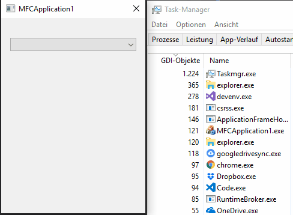

# MFC CComboBoxEx GDI Resource Leak

Windows C++ MFC CComboBoxEx GDI resource issue

I've a very simple MFC dialog, with a single [`CComboBoxEx`](https://docs.microsoft.com/en-us/cpp/mfc/reference/ccomboboxex-class?view=vs-2017) control.

*.rc*

```cpp
IDD_MFCAPPLICATION1_DIALOG DIALOGEX 0, 0, 160, 200
STYLE DS_SETFONT | DS_FIXEDSYS | WS_POPUP | WS_VISIBLE | WS_CAPTION | WS_SYSMENU | WS_THICKFRAME
EXSTYLE WS_EX_APPWINDOW
CAPTION "MFCApplication1"
FONT 8, "MS Shell Dlg", 0, 0, 0x1
BEGIN
		CONTROL  "", IDC_COMBO1, "ComboBoxEx32", CBS_DROPDOWNLIST | CBS_SORT | WS_VSCROLL | WS_TABSTOP, 10, 20, 140, 250
END
```

*c++ source code*

```cpp
class CMFCApplication1Dlg : public CDialogEx
{
public:
	CMFCApplication1Dlg(CWnd* pParent = NULL);

  virtual void DoDataExchange( CDataExchange* pDX );

	HICON m_hIcon;
	CComboBoxEx m_ctrlComboEx1;

	virtual BOOL OnInitDialog();
	afx_msg void OnPaint();
	DECLARE_MESSAGE_MAP()
};
```

```cpp
CMFCApplication1Dlg::CMFCApplication1Dlg(CWnd* pParent)
	: CDialogEx(IDD_MFCAPPLICATION1_DIALOG, pParent)
{}

void CMFCApplication1Dlg::DoDataExchange(CDataExchange* pDX)
{
	CDialogEx::DoDataExchange(pDX);
  DDX_Control(pDX, IDC_COMBO1, m_ctrlComboEx1);
}

BEGIN_MESSAGE_MAP(CMFCApplication1Dlg, CDialogEx)
END_MESSAGE_MAP()

BOOL CMFCApplication1Dlg::OnInitDialog()
{
	CDialogEx::OnInitDialog();

	for (int i = 0; i<24; i++)	// add useless junk text strings
	{
		COMBOBOXEXITEM	cbei;  memset(&cbei, 0, sizeof(cbei));

		cbei.mask = CBEIF_TEXT;
		cbei.iItem = i;
		cbei.pszText = L"useless junk text string 4 handle leaks";
		cbei.iImage = 0;
		cbei.iSelectedImage = 0;

		m_ctrlComboEx1.InsertItem(&cbei);
	}

	return TRUE;
}
```

When scrolling the items of the list box, the GDI-resources of the application rapidly increase and never get released:

See the image, which shows the effect and the increasing number of GDI-Objects in the task manager:



It seems this is related to the blue "highlighting" of the text items.

Windows-Specification

    Edition                    Windows 10 Home
    Version                    1809
    Installed on               19.12.2018
    Operating System Build     17763.253

Scree scale 100%

Build

- Windows SDK Version 10.0.17763.0
- Visual Studio 2017 (v141)
- MFC in shared DLL
- Unicode  

The issue accurse in both x64 Debug an Release configuration, so it seems not to be related to debug or optimization settings.

Is this a bug in my tiny application or is this a (possibly know) windows system bug?

---

StackOverflow question: [MFC CComboBoxEx GDI Resource Leak](https://stackoverflow.com/questions/54297350/mfc-ccomboboxex-gdi-resource-leak)